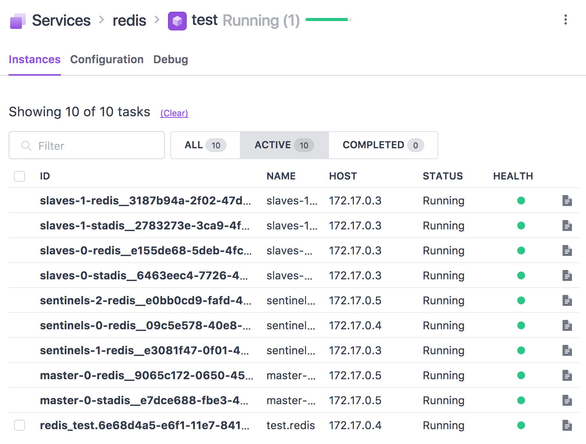

Redis Scheduler for DC/OS
------------------------

# Redis scheduler for DC/OS



## Features
* The major 25 properties are configurable from scheduler.
* Running 1 master node
* Running N slave nodes
* Running N sentinel nodes(Optional)
* Export redis stats to dcos-metrics(Optional)
* redis master client endpoint: `client.<redis-frameworkname>.l4lb.thisdcos.directory:6379`
 * If service is running under the sub group, endpoint is: `client.<subgroup><servicename>.l4lb.thisdcos.directory:6379`
 
## Additional API
### Sentinel API
endpoint: /v1/sentinel
* /info: `GET`. information of sentinel. 
```json
{
  "tcp_port": "26379",
  "uptime_in_seconds": "701",
  "uptime_in_days": "0",
  "blocked_clients": "0",
  "total_net_input_bytes": "106852",
  "hz": "13",
  "redis_build_id": "7f07dab29f71b06d",
  "sync_partial_err": "0",
  "master0": "name=mymaster,status=ok,address=9.0.0.4",
  "multiplexing_api": "epoll",
  "client_biggest_input_buf": "0",
  "sentinel_tilt": "0",
  "sentinel_running_scripts": "0",
  "used_cpu_user": "0.73",
  "redis_mode": "sentinel",
  "redis_git_dirty": "0",
  "evicted_keys": "0",
  "redis_version": "3.2.11",
  "sentinel_simulate_failure_flags": "0",
  "instantaneous_ops_per_sec": "2",
  "process_id": "13",
  "used_cpu_sys": "1.45",
  "gcc_version": "6.3.0",
  "sync_full": "0",
  "sentinel_scripts_queue_length": "0",
  "connected_clients": "3",
  "total_net_output_bytes": "12136",
  "pubsub_channels": "0",
  "arch_bits": "64",
  "sentinel_masters": "1",
  "instantaneous_input_kbps": "0.11",
  "used_cpu_sys_children": "0.00",
  "config_file": "/mnt/mesos/sandbox/./redis-sentinel.conf",
  "lru_clock": "4392755",
  "sync_partial_ok": "0",
  "pubsub_patterns": "0",
  "redis_git_sha1": "00000000",
  "run_id": "18411117877fb0fece5fe5eb63d8e1ff78d21a54",
  "latest_fork_usec": "0",
  "os": "Linux 3.10.0-693.el7.x86_64 x86_64",
  "rejected_connections": "0",
  "total_commands_processed": "2024",
  "expired_keys": "0",
  "client_longest_output_list": "0",
  "keyspace_misses": "0",
  "executable": "/usr/local/bin/redis-server",
  "instantaneous_output_kbps": "0.02",
  "keyspace_hits": "0",
  "used_cpu_user_children": "0.00",
  "total_connections_received": "3",
  "migrate_cached_sockets": "0"
}
```

* /info/{section}: `GET` specific section of sentinel info. Sections are one of `Server`, `CPU`, `Clients`, `Stats`, `Sentinel`.

* /masters: `GET`. list of master nodes. Currently the list shows only one master.
```json
{
  "name":"mymaster",
  "ip":"9.0.0.194",
  "port":"6379",
  "runid":"d23f856e265f4144e4ff76ffafe42b4fcb4ec014",
  "flags":"master",
  "link-pending-commands":"0",
  "link-refcount":"1",
  "last-ping-sent":"0",
  "last-ok-ping-reply":"341",
  "last-ping-reply":"341",
  "down-after-milliseconds":"60000",
  "info-refresh":"7084",
  "role-reported":"master",
  "role-reported-time":"398981",
  "config-epoch":"0",
  "num-slaves":"2",
  "num-other-sentinels":"2",
  "quorum":"2",
  "failover-timeout":"180000",
  "parallel-syncs":"1"
}
```

* /masters/{masterName}/slaves: `GET`. list of slave nodes. 
```json
[
  {
    "name":"9.0.0.6:6379",
    "ip":"9.0.0.6",
    "port":"6379","runid":"3120a37f0a42eb47934d9dd1327c539a1c5776b5",
    "flags":"slave","link-pending-commands":"0",
    "link-refcount":"1","last-ping-sent":"0",
    "last-ok-ping-reply":"27","last-ping-reply":"27",
    "down-after-milliseconds":"60000","info-refresh":"718",
    "role-reported":"slave","role-reported-time":"182540",
    "master-link-down-time":"0","master-link-status":"ok",
    "master-host":"9.0.0.4","master-port":"6379","slave-priority":"100",
    "slave-repl-offset":"35774"
  },
  {
    "name":"9.0.0.133:6379","ip":"9.0.0.133",
    "port":"6379","runid":"b9a46688caa218bbf7115d1d765956a539757059","flags":"slave",
    "link-pending-commands":"0","link-refcount":"1","last-ping-sent":"0",
    "last-ok-ping-reply":"316","last-ping-reply":"316","down-after-milliseconds":"60000",
    "info-refresh":"1687","role-reported":"slave","role-reported-time":"152415",
    "master-link-down-time":"0","master-link-status":"ok",
    "master-host":"master-0-redis.redis.autoip.dcos.thisdcos.directory",
    "master-port":"6379","slave-priority":"100",
    "slave-repl-offset":"35622"
  }
]
```

* /clients: list of clients. Return plain text yet.
```
id=2 addr=9.0.0.135:55460 fd=16 name=sentinel-3730aadb-cmd age=457 idle=1 flags=N db=0 sub=0 psub=0 multi=-1 qbuf=0 qbuf-free=0 obl=0 oll=0 omem=0 events=r cmd=ping
id=3 addr=9.0.0.10:45698 fd=17 name=sentinel-d8bfde6b-cmd age=457 idle=0 flags=N db=0 sub=0 psub=0 multi=-1 qbuf=0 qbuf-free=0 obl=0 oll=0 omem=0 events=r cmd=ping
id=4 addr=9.0.0.193:58814 fd=22 name= age=0 idle=0 flags=N db=0 sub=0 psub=0 multi=-1 qbuf=0 qbuf-free=32768 obl=0 oll=0 omem=0 events=r cmd=client
```

### Benchmark
* Start benchmark plan like:
```
$ dcos redis plan start benchmark \
    -p REDIS_CLIENT_PORT=6379 \
    -p REDIS_BENCHMARK_CLIENTS=50 \
    -p REDIS_BENCHMARK_REQUESTS=100000 \
    -p REDIS_BENCHMARK_DATASIZE=2 
```

* Then see `STDOUT` log of `benchmark-0-node`:
```
98.60% <= 25 milliseconds
98.73% <= 26 milliseconds
98.83% <= 27 milliseconds
98.93% <= 28 milliseconds
99.08% <= 29 milliseconds
99.29% <= 30 milliseconds
99.41% <= 31 milliseconds
99.65% <= 32 milliseconds
99.82% <= 33 milliseconds
99.89% <= 34 milliseconds
99.97% <= 35 milliseconds
100.00% <= 35 milliseconds
22650.06 requests per second

```

# How to use 
## Build
```bash
$ cd frameworks/redis/
$ ./build.sh
```

## Use Universe

* Serve `frameworks/redis/build/distributions/*.zip` files in httpd.
* Serve `sdk/bootstrap/bootstrap` file in httpd.
* Copy `frameworks/redis/universe/*` to `universe/repo/B/beta-etcd/0/*`
* Replace file assets in `resource.json` with:
```json
    {
      "jre-tar-gz": "https://downloads.mesosphere.com/java/jre-8u131-linux-x64-jce-unlimited.tar.gz",
      "libmesos-bundle-tar-gz": "https://downloads.mesosphere.io/libmesos-bundle/libmesos-bundle-1.10-1.4-63e0814.tar.gz"
    }
``` 

* Replace `bootstrap` asset in `resource.json` with proper location.
* Replcae `scheduler-zip` asset in `resource.json` with proper location.
* Replcae `executor-zip` asset in `resource.json` with proper location.

* Build local universe.

## Use pre-built docker image

* Use `minyk/dcos-redis:v0.1` from Docker hub, and marathon.json(frameworks/redis/docker/marathon.json).
 * See also marathon-subgroup.json

# Limitations
* Only in `replication` mode. `redis-cluster` is not supported yet.
* Some system parameters(vm.overcommit_memory, somaxconn, THP) are not controllable at the scheduler. 
* Scheduler does not provide a full configuration of redis servers.